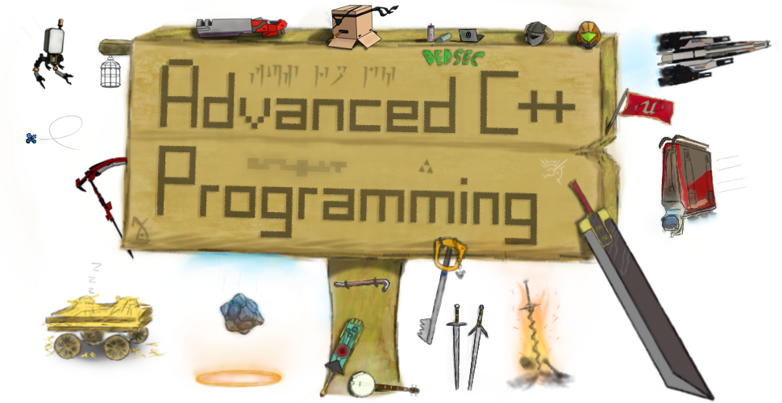

|    Date    |         Topic / Exercise          |
| ---------- | --------------------------------- |
| 2018-10-05 | Welcome                           |
| 2018-10-12 | [Infrastructure]                  |
| 2018-11-09 | [A Good Read]                     |
| 2018-11-16 | [New Tools in a Familiar Context] |
| 2018-11-23 | [Same Same but Different]         |
| 2018-11-30 | [Boxes and Computations]          |
| 2018-12-07 |                                   |
| 2018-12-14 |                                   |
| 2019-01-11 |                                   |
| 2019-01-18 |                                   |
| 2019-01-25 |                                   |
| 2019-02-01 |                                   |

[Infrastructure]: ex01
[A Good Read]: ex02
[New Tools in a Familiar Context]: ex03
[Same Same but Different]: ex04
[Boxes and Computations]: ex05

The lab takes place in [rr15](https://www.uibk.ac.at/zid/raeume/architekturgebaeude/rr15.html).

# Grading

Grading is done through weekly exercise sheets and QA sessions regarding the side project.

At the beginning of each lab your team is asked to mark the exercises you have solved *and* prepared for presentation.
Marking an exercise not only means that you have a solution, but also that you are able to explain it to the class.
You'll have to answer questions related to the exercise as well as the surrounding context.
You can use the time after the exercises have been presented to work on your side project.
During this time I'll go from team to team and ask questions.
To pass this PS you have to:

- obtain at least 76% of all exercise points (excluding bonus exercises);
- receive at least one positive grade for a presentation;
- receive at least one positive grade for a QA session; and
- complete the side project

Given these requirements are met, your final grade is simply the average of the first 3 bullets.
The side project itself is not graded since it serves as a sandbox for experimentation.

## Exercises

Exercises can build on-top of each other – even across exercise sheets.
Solutions will *not* be provided under normal circumstances.

Each folder with the `ex` prefix represents one exercise sheet.
Tasks and related material are located within said folder.
Each task is worth a certain number of points based on the estimated workload.

You do not have to submit your solution unless stated explicitly.

I may put together some general feedback after the lab and add it to this repository.
Study these additions before the next lab starts.

## Presentation

How exactly you present your solution is up to you.
Just be prepared to fit your explanation in a 15 minute time slot.
I'll ask questions during the presentation.
Questions from the audience are welcome.

Use a high-contrast colour theme and an easy-to-read font.

While a computer is provided by the ZID, you are advised to bring your own laptop.
Please check if your system is compatible with the installed projector before the lab starts.
Don't forget your adapters.

> In ZID we *do not* trust.

## Side Project

The goal of the side project is to become more fluent with the C++ programming language and its standard library.

There are two options:
(a) create a Metroidvania-like side-scroller following the provided specification; or
(b) come up with your own idea for a side project and ask me for confirmation.
The second option requires you to write a specification upfront, explaining details and establishing objectives.

How much you get out of the side project is entirely up to you.
If you feel like you are learning more from the regular exercises, you are probably not pushing yourself hard enough.

## Absence

You must not be absent more than three times.
You do not have to inform me of your absence.

If a team is only partially present, it can still mark exercises.
However, only the people presenting will receive a grade.
Same goes for the QA sessions.

Note that I will *not* take absence statistics into account when selecting people for presentation or QA.

# Contacting Me

If you have questions or want to know more about a certain topic, I am always glad to help.
You can find me in room 2W05 of the ICT building.

You can also contact me by email, just be sure to send it from your university account.
Please keep your email informal and include the course number in the subject.
Preferably use the following link.

📧 [send email](mailto:alexander.hirsch@uibk.ac.at?subject=703807%20-%20)

# Formatting

I highly recommend using a source code formatting tool.
Configurations for [Clang Format] and [EditorConfig] are provided – use these as a starting point.

[Clang Format]: http://clang.llvm.org/docs/ClangFormat.html
[EditorConfig]: https://editorconfig.org/

# Essential References

- [C++ 17 Standard (Draft)](http://www.open-std.org/jtc1/sc22/wg21/docs/papers/2017/n4659.pdf)
- [C++ Core Guidelines](http://isocpp.github.io/CppCoreGuidelines/CppCoreGuidelines)
- [cppreference.com](http://en.cppreference.com)

# Useful References / Tools

- [Awesome Modern C++](https://github.com/rigtorp/awesome-modern-cpp)
- [Boost](http://www.boost.org)
- [C++ 20 Standard (Draft)](https://github.com/cplusplus/draft/raw/master/papers/n4762.pdf)
- [Clang Sanitizers](https://clang.llvm.org/docs/UsersManual.html#controlling-code-generation)
- [Clang Tidy](http://clang.llvm.org/extra/clang-tidy/)
- [CMake](https://cmake.org)
- [Curated List of Awesome C/C++ Stuff](https://github.com/fffaraz/awesome-cpp)
- [DevDocs](https://devdocs.io/)
- [Doxygen](http://www.stack.nl/~dimitri/doxygen)
- [Google C++ Style Guide](https://google.github.io/styleguide/cppguide.html)
- [Google Test](https://github.com/google/googletest)
- [Modern C++ Features](https://github.com/AnthonyCalandra/modern-cpp-features)
- [Online C++ Demangler](https://demangler.com)
- [STL Containers](http://en.cppreference.com/w/cpp/container)
