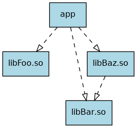
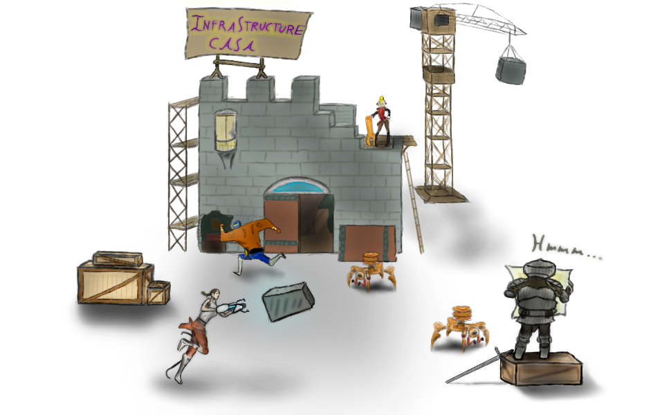

# Exercise Sheet 1 – Infrastructure

*due on 12 October 2018*

In this exercise sheet you are asked to set up some infrastructure for developing C++ applications.
The time required for this exercise sheet varies depending on how much experience you have with installing software and setting up build environments.
If you run into problems consult your fellow students first and contact me if the problem persists.

## Task 1 (2 Points)

Install G++ and Clang, then compile the provided file `hello.cpp`.
Be sure to install a version that supports C++17.
Use the following flags when compiling:

    -std=c++17 -Wall -Wextra -O2

If you are a Windows user, you may instead use the Visual Studio compiler.
Adjust the compile flags accordingly.
Alternatively, use [WSL](https://en.wikipedia.org/wiki/Windows_Subsystem_for_Linux) instead.

Next, set up [Boost](http://www.boost.org/) on your system and compile the provided file `hello_boost.cpp`.
Boost is quite common and provides you with a set of useful C++ libraries.
Some of its content is even promoted into the C++ standard library.

## Task 2 (2 Points)

Run Clang on the provided file `vec.cpp` using the following command:

    $ clang -std=c++17 -Xclang -ast-dump -fsyntax-only -Wno-vexing-parse vec.cpp

Clang will parse the input file and display its abstract syntax tree (AST).
In the bottom half of the output you find the function declaration of `main` followed by its `CompoundStmt`.
Take a close look at its children and compare the resulting AST with the input code.
Notice any oddities – something that looks counter intuitive?

Sometimes looking at the AST of a C++ program helps to understand what is really going on behind the scenes.
Clang is a useful tool for this purpose.
G++ also provides some mechanisms to dump internal representations, but I find Clang's AST more accessible.

As you can see, there are multiple different ways of initialisation in C++.
Check out the [corresponding section at cppreference](https://en.cppreference.com/w/cpp/language).

## Task 3 (3 Points)

The directory `task3` hosts four subdirectories, `libFoo`, `libBar`, `libBaz`, and `app`.

Each folder prefixed with `lib` represents a shared library and contains a header and source file each.
Furthermore, the library `libBaz.so` depends on `libBar.so`.

`app` contains a single source file providing a `main` function.
It depends on all three libraries.

- model this project structure using [CMake](https://cmake.org/)
- be sure to set the C++ standard correctly and enable warnings (`-Wall -Wextra`)
- the default build type should be *Release*

CMake itself is a build system generator.
You can choose from a variety of target build systems.

- use `cmake` to generate the actual build system
- build the project

Take note of the following features:

- *out of source build*, generated files do not pollute the source directory
- dependencies of translation-units are automatically obtained

What else do you notice?

## Task 4 (3 Points) (Bonus)

Set up an integrated development environment (IDE) or text editor with the following features:

- syntax highlighting for C/C++
- support for snippets
- jump to line
- jump to symbol
- jump to file
- jump to definition / declaration
- quickly switch between header / source file
- find all references of a given symbol
- compile and execute by pressing one key
- *semantic auto-completion*, provides (among others) auto-completion based on types
- debugger integration

While it is not *required* to have such an environment to develop C++ programs, it certainly improves your productivity.

## Note

Do not forget to send me the mail regarding your team composition.
See the introductory slides for details.

## Additional Resources

- [Compiler Explorer](https://godbolt.org/)
- [Compiler Explorer inside Emacs](https://github.com/emacsmirror/rmsbolt)
- [GNU Global – source code tagging system](https://www.gnu.org/software/global/)
- [rtags – C/C++ client/server indexer](https://github.com/Andersbakken/rtags)
- [cquery – C/C++ language server](https://github.com/cquery-project/cquery)
- [Clangd – C/C++ language server (experimental)](https://clang.llvm.org/extra/clangd.html)
- [GDB dashboard](https://github.com/cyrus-and/gdb-dashboard)
- [Radare – reverse engineering framework](https://rada.re/r/)
- [Cutter – GUI for Radar](https://github.com/radareorg/cutter)

- - - - - - - - - - - - - - - - - - - - - - - - - - - - - - - - - - - - - - - -

