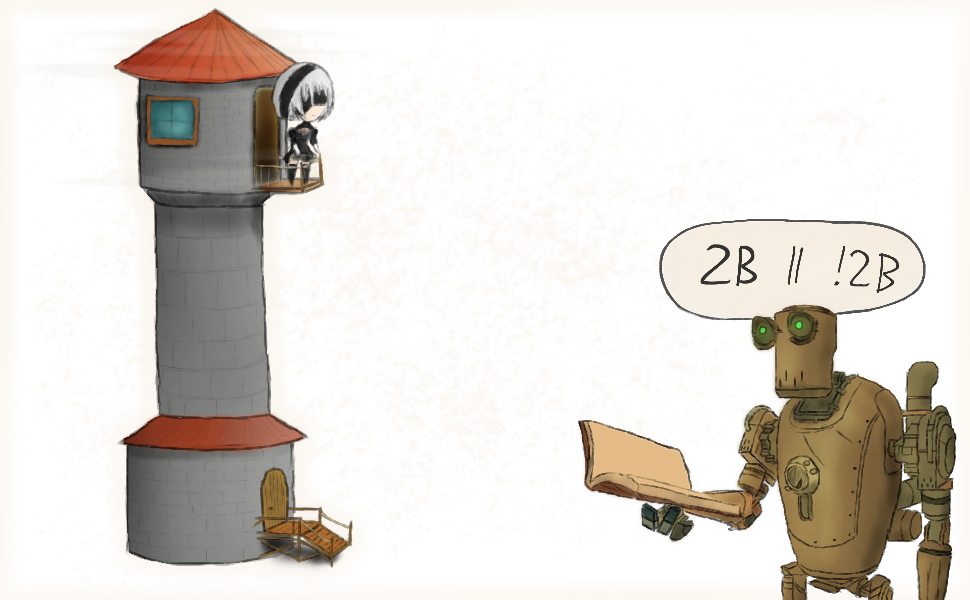

# Exercise Sheet 2 – A Good Read

*due on 9 November 2018*

Well, since the lecture just started and we won't see each other for some time, I'll keep this one short.

I encourage you to get started with the side project and pick up a book on C++ along the way.
It should help getting more familiar with common C++ idioms.

## Task 1 (4 Points)

Skim over the [C++ Core Guidelines](http://isocpp.github.io/CppCoreGuidelines/CppCoreGuidelines) and pick 5 bullets you find interesting.
Prepare these 5 bullets for presentation.

At this point, some things may still be a mystery to you.
Research the yet unknown concepts and techniques mentioned in the C++ Core Guidelines relevant to the bullets you picked.
Be prepared to give a short summary of these concepts and techniques in your presentation so your fellow students can follow.

## Custom Side Project Specification

This task is only relevant if you are doing a custom side project.

Write an initial, complete specification of your side project.
While it has to be complete, details may be adapted over time.

Start off your document with an overview section communicating the big picture.
The final section has to be a list of features which need to be implemented in order to consider your project complete.

You can use the *Metroidvania* specification as a guideline.
Yet, your specification should not have that many gaps.
Be short and precise.

I accept three different file formats for the specification:

- self-contained plain text file
    - column limit 80
    - paragraphs clearly separated
    - headings clearly visible
    - UTF-8 encoded
    - Unix line endings (`\n`)
    - trailing newline
    - ASCII art images (may use UTF-8 characters)
    - similar to [phrack](http://www.phrack.org) articles
- self-contained HTML document
    - embed images
    - preferably no Javascript
- self-contained PDF

Use the following subject and file name, where `XX` is your team number with leading zero (eg `07`):

    subject:  703807 - Team XX Specification
    filename: team_XX_specification.txt
              team_XX_specification.html
              team_XX_specification.pdf

You can use the following link:

📧 [send email](mailto:alexander.hirsch@uibk.ac.at?subject=703807%20-%20Team%20XX%20Specification)

## Additional Resources

- 🎥 [CppCon 2018 – *Simplicity: Not Just For Beginners*](https://www.youtube.com/watch?v=n0Ak6xtVXno)

- - - - - - - - - - - - - - - - - - - - - - - - - - - - - - - - - - - - - - - -

