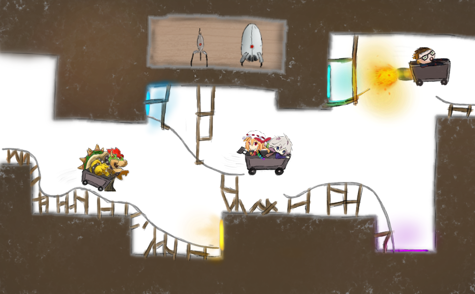

# Exercise Sheet 3 – New Tools in a Familiar Context

*due on 16 November 2018*

## Task 1 (4 Points)

This task focuses on the correct implementation of RAII as well as copy and move semantics.
You are asked to implement the concept of `unique_ptr` and `shared_ptr`.
Since we won't concern ourselves with templates for the moment your implementation will *own* an instance of the following `struct`.

```cpp
struct Vec2 {
    int x, y;
};
```

- read the documentation regarding *smart pointers*, `unique_ptr`, and `shared_ptr`
- implement your version of `unique_ptr_to_vec2` and `shared_ptr_to_vec2` fulfilling these requirements:
    - *dynamically* allocate an instance of `Vec2` in your constructor (initialise `x` and `y` to `0`)
    - deallocate the `Vec2` instance in your destructor
    - implement correct copy semantics (copy constructor / copy assignment)
    - implement correct move semantics (move constructor / move assignment)
    - enable access to `Vec2` via the operators `*` and `->`
    - thread-safety for `shared_ptr_to_vec2`'s reference counter is not required
    - pay attention to corner-cases like self-assignment (`v = v`)
- prepare a few interesting test cases for your presentation
- check your implementation for memory leaks and memory corruption using `valgrind`

## Task 2 (2 Points)

Examine the program `iterations.cpp` and think about the expected output.
Compile the program and run it.
What do you notice?
Did you expect this behaviour?
Did you get any compiler warnings?
Investigate what is actually happening (consider using `valgrind` or a debugger).

How can such errors be prevented?
Look for tools (ex: static code analysers) which help discovering such faulty code.

**Note:** If you run the executable and everything seems normal, try changing the initial content of `xs`, using different optimisation flags, or a different compiler.
The actual behaviour of this executable depends on various factors.

## Task 3 (2 Points)

You are given the program `strange.cpp`.
Compile it with different compilers and optimisation flags.
What do you notice?
What is really happening here?

## Task 4 (Bonus) (2 Points)

Create a *copy-on-write smart pointer* for `Vec2` (see task 1).
Assume the underlying struct is accessed for writing when the smart pointer is used in a *non-const* context.
Otherwise, assume read access.

Again, provide a few test cases for your presentation.

## Additional Resources

- 🎥 [CppCon 2015 – *Give me 15 minutes & I'll change your view of GDB*](https://www.youtube.com/watch?v=PorfLSr3DDI)
- [Iterator Invalidation](https://en.cppreference.com/w/cpp/container#Iterator_invalidation)
- [Undefined Behaviour](https://en.cppreference.com/w/cpp/language/ub)
- [Rule of Three](https://en.wikipedia.org/wiki/Rule_of_three_(C%2B%2B_programming))
- [Defining the undefinedness of C](https://dl.acm.org/citation.cfm?id=2737979)
- [It's Time To Do CMake Right](https://pabloariasal.github.io/2018/02/19/its-time-to-do-cmake-right)

- - - - - - - - - - - - - - - - - - - - - - - - - - - - - - - - - - - - - - - -


