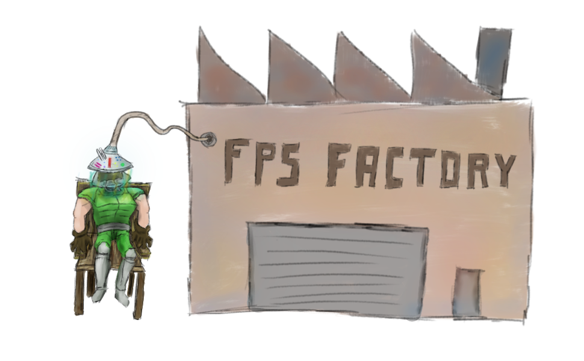

# Exercise Sheet 4 – Same Same but Different

*due on 16 November 2018*

This exercise sheet is about critical thinking.
The C++ language provides a lot of tools, each of them suited for different use cases.
It is paramount to pick the right tool for the right job as well as understanding their limitations.

## Task 1 (3 Points)

You are given the following, incomplete definition of a person and a room:

```cpp
struct Person {
    std::string first_name;
    std::string last_name;
    int age;
};

class Room {
  public:
    Room(int id, size_t limit) : id(id), limit(limit) {}

    // Returns true iff the person successfully entered.
    bool enter(/* Person */) {}

    void exit(/* Person */) {}

  private:
    const int id;
    const size_t limit;
    std::vector<...> people
};
```

`Room` contains a list of people currently located inside.
People can enter and exit the room via the respective member functions.
However, at most only `limit` people may be inside at any given time (invariant).

- add the missing pieces; pay special attention to the types

The following use cases need to be covered next:
- asking a `Room` how many people are currently located inside
- asking a `Room` whether a specific person is currently located inside
- iterating over all people currently located in a `Room`

Implement whatever is necessary to support these use cases, making sure the invariant remains intact.

How would you solve this exercise in Java?

## Task 2 (2 Points)

Implement a simple stack data structure utilising templates.
Instantiate the template at least twice with different types.

Examine the resulting object file using `nm`.

Measure the relationship between compile time and number of unique template instantiations.
Prepare a scatter plot for presentation.

## Task 3 (3 Points)

Read [this blog post](https://www.gamedev.net/blogs/entry/2265481-oop-is-dead-long-live-oop).

Prepare a short summary, paying special attention to the use of templates.
What benefits and drawbacks do you identify?

## Task 4 (1 Point)

Revisit the [template parameter pack example of the lecture](https://github.com/PeterTh/uibk_cpp/blob/master/04_templates/04_03_template_parameter_packs.cpp).

Implement a template function, which allows one to append elements to a given vector.
Utilise template parameter packs.

```cpp
std::vector<int> xs{1, 2, 3};

append(xs, 4, 5);
append(xs, 6, 7, 8);

std::vector<float> ys{1.0f, 2.0f, 3.0f};

append(ys, 4.0f, 5.0f);
append(ys, 6.0f, 7.0f, 8.0f);
```

Are there other, *similar* ways to implement such a function.
You may adjust the call site accordingly.

## Additional Resources

- 🎥 [CppCon 2018 – *OOP is dead, long live Data-oriented design*](https://www.youtube.com/watch?v=yy8jQgmhbAU)
- [vcpkg – Cross platform C++ package manager with CMake integration](https://github.com/Microsoft/vcpkg)

- - - - - - - - - - - - - - - - - - - - - - - - - - - - - - - - - - - - - - - -


