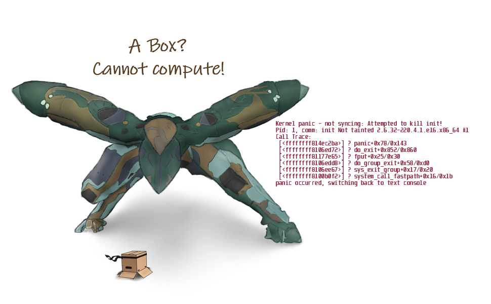

# Exercise Sheet 5 – Boxes and Computations

*due on 30 November 2018*

## Task 1 (3 Points)

You are given the following definition of a person:

```cpp
struct Person {
    std::string first_name;
    std::string last_name;
    int age;
};
```

For `Person`, taking all members into account:

- implement relational operators (`<`, `<=`, `>`, `>=`)
- implement comparison operators (`==`, `!=`)
- implement the output stream operator (`<<`)
- implement a `to_string` function (see `std::to_string`)

Next, create 5 different instances and put all of them
- in an `std::vector`;
- in an `std::set`; and
- in an `std::map` as key (we don't care about the value type of the map).

Use algorithms form the standard library, like `std::find` and `std::partition` on these containers and examine which operators are used.

*Note:* Do not add an id to `Person` as mentioned in the previous lab.

*Hint:* You may want to have a look at `std::tie`.
Otherwise, test the operators `<=`, `>`, and`>=` thoroughly.

## Task 2 (3 Points)

Take `Person` from Task 1 and implement the necessary parts for inserting it into an `std::unordered_set`.

Compare the performance (execution time) of `std::vector`, `std::list`, `std::set`, and `std::unordered_set` regarding insertion and lookup (`std::find`).
We are interested in how the execution time increases for the average insertion / lookup, as the number of elements in a container increases.

Prepare plots for your presentation.

## Task 3 (2 Point)

Again, take `Person` from Task 1.
Create an `std::vector<std::shared_ptr<Person>>` with at least 3 different instances of `Person`.

Create a function which takes a `const std::vector<std::shared_ptr<Person>>&` as input and returns an `std::vector<Person*>`.
Each element in the result vector corresponds to the respective element in the input vector.

For the functional programming nerds, the definition of this function would be something like `fmap std::shared_ptr::get`.

Write your function in different ways and compare the readability:

- use a range-based for loop
- use `std::transform`
- use a lambda expression
- use `std::mem_fn`

Think about taking the argument by value instead of taking it by const reference.

*Hint:* While not yet available in C++17, take a peek at *ranges*.

- - - - - - - - - - - - - - - - - - - - - - - - - - - - - - - - - - - - - - - -


